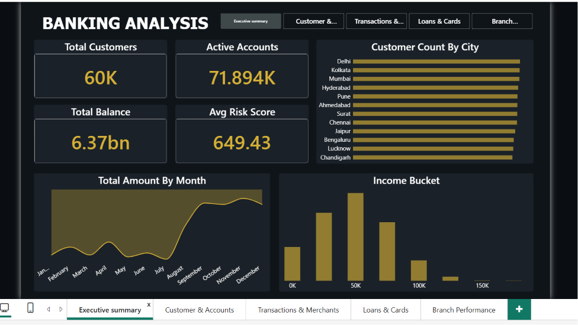
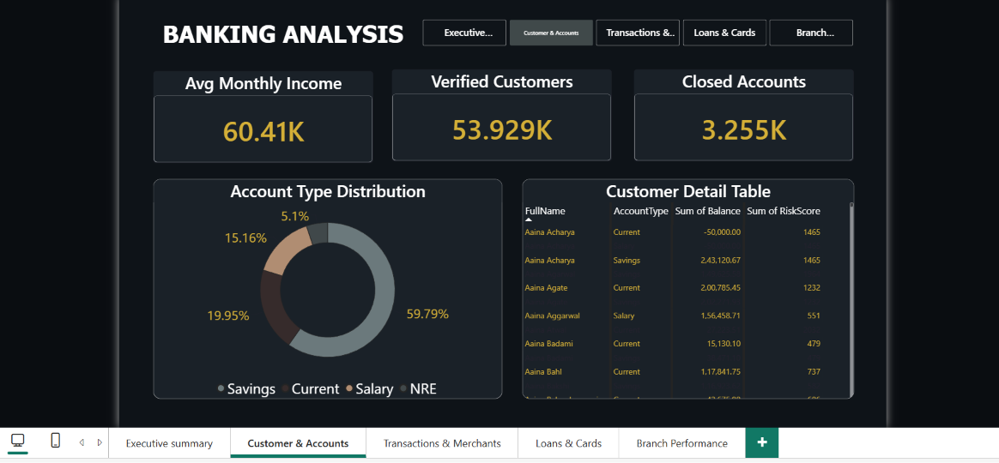
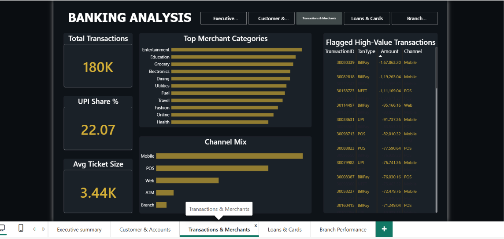
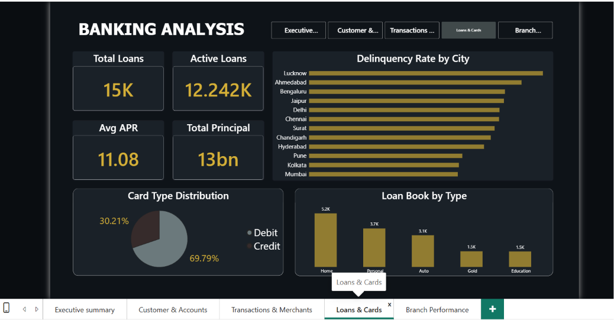
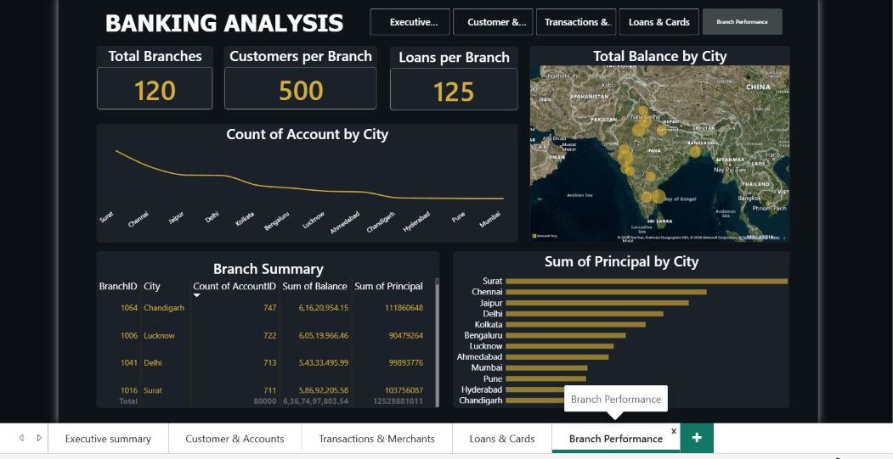

# Banking Analytics — SQL, Python & Power BI

End-to-end analytics project on a retail banking dataset, covering database design, data cleaning, KPI analysis, and a 5-page interactive dashboard. Built to practice the full analyst workflow: SQL → Python → Power BI.

## Project Overview

This project analyzes a retail bank's customers, accounts, loans, cards, and transactions to build a complete picture of bank operations — customer profiles, transaction behavior, loan and credit risk, and branch performance. The dataset is structured in a relational database, validated and analyzed in Python, and presented as a multi-page, interactive Power BI dashboard.

## Tech Stack

- **SQL (MySQL):** Schema design (7 tables), bulk data load, 2 helper views, 30 analysis queries
- **Python (pandas, matplotlib):** Data validation, KPI calculations, visualizations, anomaly flagging
- **Power BI:** 5-page interactive dashboard with cross-page navigation

## Data Model

Seven tables: `customers`, `accounts`, `branches`, `loans`, `cards`, `transactions`, `merchants`. This project uses a structured, synthetic dataset built to simulate realistic retail banking operations, since real bank data isn't accessible to students for privacy reasons.

**Relationships:**
- `customers` → `accounts` (a customer can hold multiple accounts)
- `accounts` → `transactions` (every transaction belongs to an account)
- `accounts` → `branches` (each account is opened at a branch)
- `customers` → `loans`, `customers` + `accounts` → `cards`
- `transactions` → `merchants` (every transaction maps to a merchant/category)

**Helper Views:**
- `daily_txn_summary` — daily transaction count, net amount, debit/credit split
- `customer_balance_summary` — total balance and account count per customer

## SQL Analysis (30 queries, 5 groups)

1. **Customer & Account Profiling** — city distribution, account status mix, income buckets, risk score by city
2. **Transactions & Merchant Behavior** — channel mix, top merchant categories, UPI growth, ATM share by city
3. **Risk & Anomaly Detection** — high-value transaction outliers (window functions + CTEs), dormant-but-active accounts, customer risk deciles
4. **Loans & Credit Risk** — loan book composition, delinquency rate by city, loan vintage performance, cross-sell targeting
5. **Branch Performance** — branch-wise balances and loan books, customer tenure vs balance

## Python Workflow

- Loaded the 7 source tables and ran independent data quality checks (nulls, duplicate PANs, zero-amount transactions, balance ranges)
- Calculated headline KPIs (active accounts, average risk score, total balance)
- Built visualizations: monthly transaction trend, merchant category mix, channel mix, average ticket size by transaction type
- Applied a threshold-based rule to flag high-value transactions for review
- Exported summary tables for use in Power BI

## Power BI Dashboard

Five connected pages, with consistent navigation across all of them.

### Executive Summary
Bank-level KPIs, monthly transaction trend, customer distribution by city, income buckets


### Customer & Accounts
KYC status, account type mix, customer-level detail table


### Transactions & Merchants
Channel mix, top merchant categories, flagged high-value transactions


### Loans & Cards
Loan book by type, delinquency rate by city, card type distribution


### Branch Performance
Branch-wise balance and loan book, customer/loan density per branch


## Repository Structure

```
banking-analytics/
├── banking_setup.sql              # Database, tables, data load, helper views
├── banking_analysis_queries.sql   # 30 analysis queries (5 groups)
├── banking_analysis.ipynb         # Python: cleaning, KPIs, visuals, anomaly detection
├── Banking_analytics.pbix         # Power BI dashboard (5 pages)
├── dashboards/                    # Dashboard page screenshots
│   ├── executive-summary.png
│   ├── customer-accounts.png
│   ├── transactions-merchants.png
│   ├── loans-cards.png
│   └── branch-performance.png
└── README.md
```
